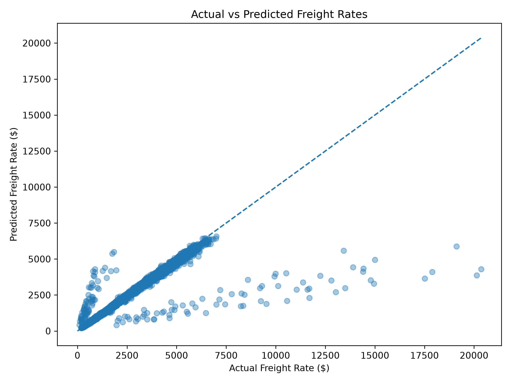
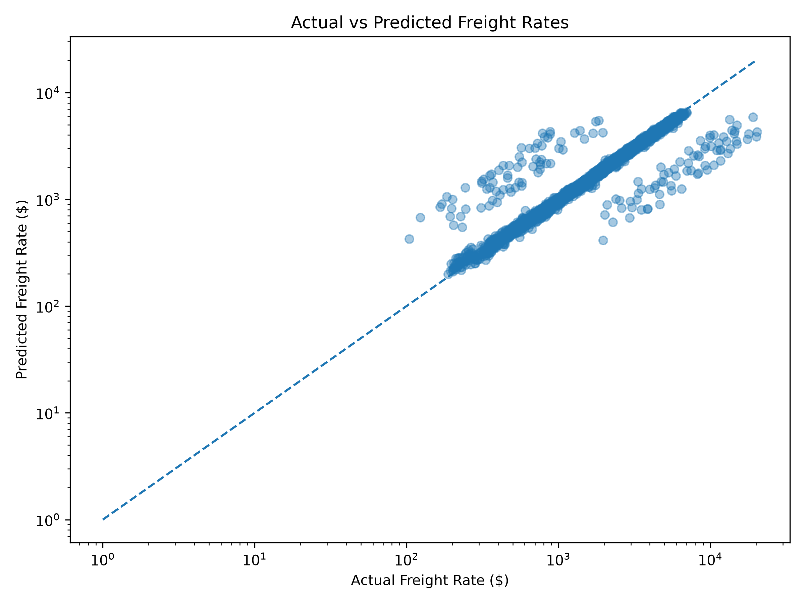
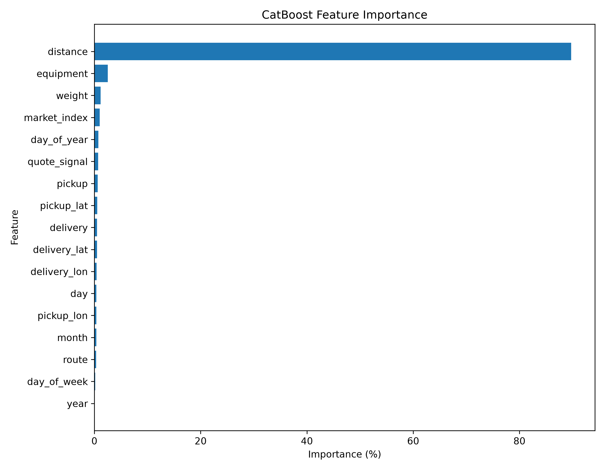
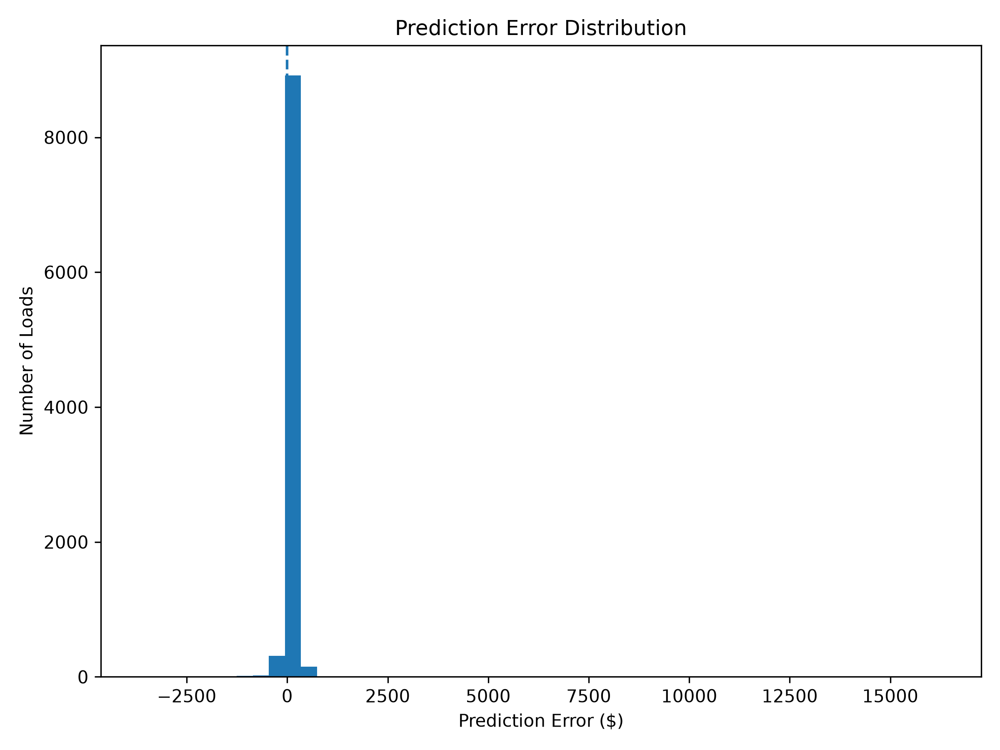
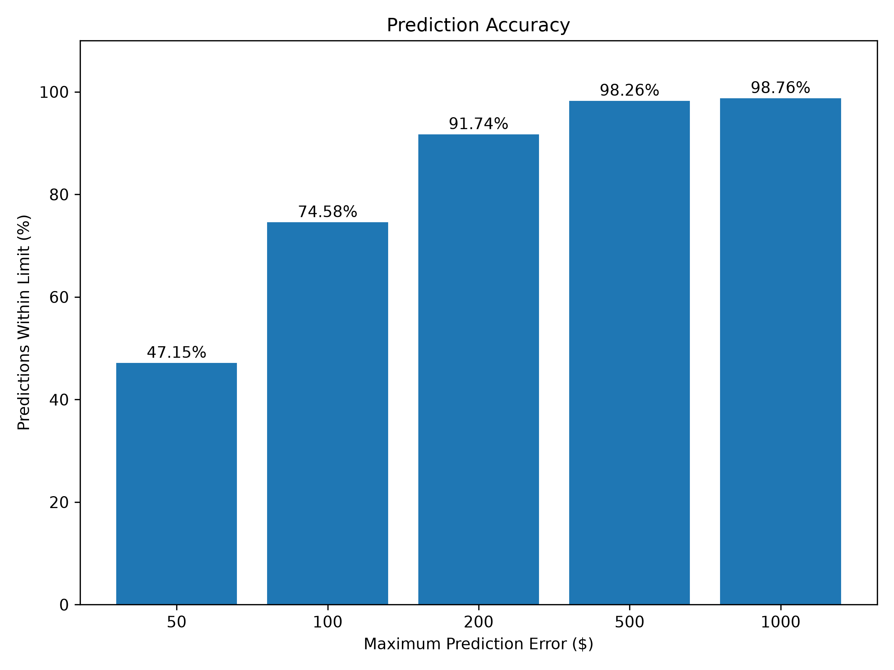

# 🚛 Freight Rate Prediction

A machine learning project for predicting freight rates based on shipment, route, equipment, weight, market, and time-related information.

The final model uses **CatBoost Regression with a log-transformed target** and a chronological train-validation split to simulate a realistic future prediction scenario.

---

## 📌 Project Overview

Freight pricing depends on several factors such as:

- Transportation distance
- Pickup and delivery locations
- Equipment type
- Shipment weight
- Market conditions
- Quote signals
- Time and seasonality

The goal of this project is to build a machine learning model that predicts the expected `posted_rate` for a freight load.

---

## 🎯 Problem Statement

Given information about a freight shipment, predict its expected freight rate.

### Target Variable

```text
posted_rate
```

### Main Features

- Pickup city
- Delivery city
- Pickup latitude/longitude
- Delivery latitude/longitude
- Distance
- Equipment type
- Weight
- Market index
- Quote signal
- Date features
- Route

---

## 📊 Dataset

The dataset contains **48,000 freight loads**.

### Date Range

```text
2025-01-01 → 2025-10-31
```

### Dataset Columns

| Feature | Description |
|---|---|
| `load_id` | Unique load identifier |
| `pickup` | Pickup city |
| `delivery` | Delivery city |
| `pickup_lat` | Pickup latitude |
| `pickup_lon` | Pickup longitude |
| `delivery_lat` | Delivery latitude |
| `delivery_lon` | Delivery longitude |
| `distance` | Shipment distance |
| `equipment` | Equipment type |
| `weight` | Shipment weight |
| `date` | Load date |
| `market_index` | Market-related indicator |
| `quote_signal` | Quote-related signal |
| `posted_rate` | Target freight rate |

---

## 🧹 Data Cleaning

The following preprocessing steps were performed:

- Converted the `date` column to datetime format.
- Identified missing values.
- Negative weight values were treated as invalid and replaced with missing values.
- Checked for duplicate rows.
- Checked for duplicate load IDs.

---

## 🔧 Feature Engineering

The following date-based features were created:

```text
year
month
day
day_of_week
day_of_year
```

A route feature was also created:

```text
pickup -> delivery
```

Example:

```text
Bakersfield -> Hartford
```

### ⚠️ Target Leakage Prevention

During EDA, `rate_per_mile` was investigated:

```text
rate_per_mile = posted_rate / distance
```

However, it was **not used as a model feature** because it directly depends on the target variable `posted_rate`.

Using it during training would cause **target leakage**.

---

## ⏱️ Train-Validation Split

A chronological split was used instead of a random train-test split.

This is more realistic because in real freight prediction, historical data is used to predict future loads.

### Training Set

```text
Rows: 38,477
Period: 2025-01-01 → 2025-08-31
```

### Validation Set

```text
Rows: 9,523
Period: 2025-09-01 → 2025-10-31
```

---

# 🤖 Model Development

Several approaches were evaluated.

## 1. Standard CatBoost

Baseline model performance:

```text
MAE:  $138.48
RMSE: $641.68
R²:   0.8232
```

## 2. Log-Target CatBoost

Because freight rates contain a strong right-skew and rare extreme values, the target was transformed using:

```python
np.log1p(posted_rate)
```

Predictions were converted back to the original dollar scale using:

```python
np.expm1(prediction)
```

This approach produced the best overall results.

## 3. Two-Stage Model

A two-stage approach was also tested:

```text
Stage 1 → High-rate classifier
Stage 2 → Separate regression models
```

However, the classifier failed to identify the rare high-rate validation loads reliably.

Therefore, the two-stage approach was not selected as the final model.

---

# 🏆 Final Model

## Log-Target CatBoost Regressor

### Configuration

```text
Iterations:       1000
Learning Rate:    0.05
Depth:             8
Loss Function:    RMSE
Random Seed:      42
```

---

## 📈 Final Model Performance

| Metric | Result |
|---|---:|
| MAE | **$130.92** |
| RMSE | **$639.73** |
| R² | **0.8243** |
| Within $50 | **47.15%** |
| Within $100 | **74.58%** |
| Within $200 | **91.74%** |
| Within $500 | **98.26%** |
| Within $1,000 | **98.76%** |

### Interpretation

The model achieved an **MAE of $130.92**, meaning the average absolute difference between predicted and actual freight rates is approximately $131 on the validation set.

The model achieved an **R² score of 0.8243**, indicating that it explains a substantial portion of the variation in freight rates on the chronological validation data.

---

# 📊 Feature Importance

| Feature | Importance |
|---|---:|
| `distance` | **89.72%** |
| `equipment` | **2.51%** |
| `weight` | **1.15%** |
| `market_index` | **1.01%** |
| `day_of_year` | **0.73%** |
| `quote_signal` | **0.71%** |
| `pickup` | **0.61%** |

### Key Finding

**Distance is by far the dominant feature used by the model.**

This is intuitive for freight pricing because longer transportation routes generally require higher freight charges.

> Feature importance represents how much the model relies on a feature; it should not be interpreted as a causal percentage of the freight price.

---

# 📊 Visualizations

## Actual vs Predicted



## Actual vs Predicted — Log Scale



## Feature Importance



## Prediction Error Distribution



## Prediction Accuracy



---

# ⚠️ High-Rate Load Analysis

The dataset contains a small number of extreme freight-rate observations.

### Full Dataset

```text
Loads above $10,000: 103
```

### Validation Set

```text
Loads above $10,000: 24
```

The final model's MAE for these high-rate validation loads was approximately:

```text
$10,310
```

The model generally underpredicts these rare extreme observations.

### Why?

The available input features do not provide enough information to reliably distinguish these exceptional loads from normal loads.

Although these extreme loads often have unusually high rate-per-mile values, `rate_per_mile` cannot be directly used as a model feature because:

```text
rate_per_mile = posted_rate / distance
```

and `posted_rate` is the target being predicted.

Using this feature would introduce target leakage.

This is an important limitation of the current dataset and model.

---

# 📁 Project Structure

```text
freight-rate-ml/
│
├── data/
│   ├── train-test.csv
│   ├── final_model_predictions.csv
│   ├── final_feature_importance.csv
│   ├── model_predictions.csv
│   ├── model_predictions_log.csv
│   └── model_predictions_two_stage.csv
│
├── models/
│   └── final_freight_rate_catboost.cbm
│
├── plots/
│   ├── actual_vs_predicted.png
│   ├── actual_vs_predicted_log.png
│   ├── feature_importance.png
│   ├── error_distribution.png
│   └── prediction_accuracy.png
│
├── analysis.py
├── eda.py
├── plot_results.py
├── requirements.txt
└── README.md
```

---

# 🛠️ Tech Stack

- Python
- Pandas
- NumPy
- Matplotlib
- Scikit-learn
- CatBoost
- VS Code

---

# 🚀 How to Run

## 1. Clone the Repository

```bash
git clone https://github.com/codewithDhruv8417/freight-rate-ml.git
cd freight-rate-ml
```

## 2. Install Dependencies

```bash
pip install -r requirements.txt
```

## 3. Run the Final Model

```bash
python analysis.py
```

The trained model will be saved to:

```text
models/final_freight_rate_catboost.cbm
```

Validation predictions will be saved to:

```text
data/final_model_predictions.csv
```

## 4. Generate Visualizations

```bash
python plot_results.py
```

The graphs will be saved inside:

```text
plots/
```

---

# 🔮 Future Improvements

Possible future improvements include:

- Add fuel prices and fuel surcharge information.
- Add lane-level historical pricing.
- Add seasonal and holiday indicators.
- Add regional supply/demand information.
- Add carrier availability.
- Add weather and disruption information.
- Investigate the source of extreme high-rate observations.
- Collect more high-rate examples.
- Explore ensemble models.
- Build a REST API for real-time freight-rate prediction.
- Add model monitoring.
- Implement periodic model retraining as market conditions change.

---

# 📌 Key Takeaways

1. **Distance is the dominant predictive feature.**
2. **Log-target CatBoost performed better than the standard CatBoost baseline.**
3. The final model achieved an **MAE of $130.92**.
4. The final model achieved an **R² of 0.8243**.
5. **91.74% of predictions are within $200** of the actual rate.
6. **98.26% of predictions are within $500**.
7. Rare extreme-rate loads remain difficult to predict.
8. Chronological validation provides a more realistic evaluation for future freight-rate prediction.

---

# 👨‍💻 Author

**Dhruv Sharma**

B.Tech CSE (AI & ML)

---

# 📄 License

This project is intended for educational, portfolio, and research purposes.
